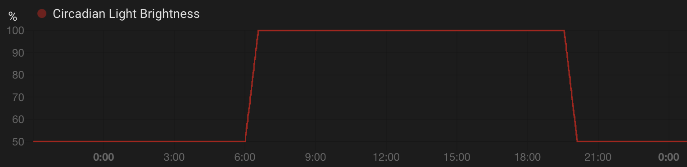
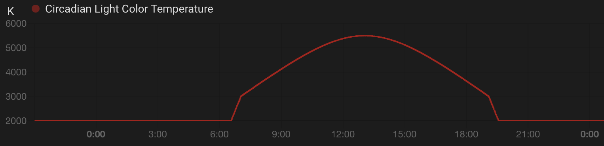

# Circadian lighting

The circadian lighting package brings several features that help to mimick the Sun light with connected lights.

## Features

### Brightness

The function `Brightness` returns a brightness percentage between 0% and 100% (int64) depending on:

* a date with time (time.Time)
* a latitude (float64)
* a longitude (float64)

Current configuration is as follow:

* during civil twilight ( sun elevation > -6° ): Brightness = 100%
* between civil and nautical twilight ( -12° < sun elevation < -6° ): Brightness = linear function of sun elevation between 50% and 100%
* during the night ( sun elevation < -12° ): Brightness = 50%

### Color temperature

The function `ColorTemp` returns a color temperature in Kelvin between 2000K and 5500K (int64) depending on:

* a date with time (time.Time)
* a latitude (float64)
* a longitude (float64)

Current configuration is as follow:

* during twilight ( sun elevation > -0.833° ): ColorTemp = linear function of sun elevation between 3000K and 5500K
* between twilight and civil twilight ( -6° < sun elevation < -0.833° ): ColorTemp = linear function of sun elevation between 2000K and 3000K
* during the night ( sun elevation < -6° ): ColorTemp = 2000K

